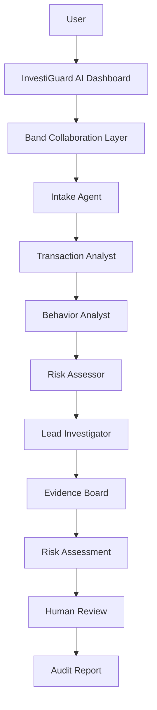

# 🛡️ InvestiGuard AI

### Multi-Agent Fraud Investigation Platform

InvestiGuard AI is a multi-agent fraud investigation system built for high-stakes financial workflows. Instead of relying on a single AI model, multiple specialized agents collaborate through a shared communication layer to investigate suspicious transactions, exchange evidence, assess risk, and generate explainable recommendations for human investigators.

## 🔗 Live Demo

[Launch InvestiGuard AI](https://d29chmexl6i9gnf04rwiqucxq.nativelyai.app/)

---

## 🚀 Problem

Financial institutions process thousands of suspicious transactions daily. Traditional fraud detection systems often provide risk scores without transparent reasoning, making investigations slow, difficult to audit, and challenging to explain.

Organizations need:

* Faster investigations
* Transparent decision-making
* Human oversight
* Traceable evidence chains
* Collaborative analysis

---

## 💡 Solution

InvestiGuard AI introduces a multi-agent investigation workflow where specialized AI agents work together to analyze financial transactions.

Each agent contributes unique expertise while sharing findings, evidence, and context with the rest of the system.

The result is an explainable, auditable, and collaborative fraud investigation process.

---

## 🤖 Agent Architecture

### 1. Intake Agent

* Receives suspicious transaction reports
* Creates investigation cases
* Assigns analysis tasks

### 2. Transaction Analyst

* Reviews transaction patterns
* Detects structuring behavior
* Identifies suspicious transfer activity

### 3. Behavior Analyst

* Evaluates customer history
* Compares activity against baseline behavior
* Detects anomalies

### 4. Risk Assessor

* Aggregates evidence
* Calculates fraud probability
* Produces risk scores

### 5. Lead Investigator

* Reviews all agent findings
* Generates final recommendations
* Escalates cases for human review

---

## 🔄 Multi-Agent Collaboration Workflow

```text
Suspicious Transaction
          │
          ▼
     Intake Agent
          │
          ▼
 Transaction Analyst
          │
          ▼
  Behavior Analyst
          │
          ▼
    Risk Assessor
          │
          ▼
 Lead Investigator
          │
          ▼
   Human Review
          │
          ▼
    Audit Report
```

Agents collaborate by:

* Sharing evidence
* Delegating tasks
* Referencing previous findings
* Building a common investigation context
* Producing transparent recommendations

---

## ✨ Key Features

### 📊 Investigation Dashboard

* Active cases overview
* Risk monitoring
* Investigation tracking

### 🌐 Agent Collaboration Network

* Visual representation of agent interactions
* Agent status tracking
* Handoff visualization

### 💬 Agent Collaboration Feed

* Real-time investigation messages
* Evidence sharing
* Task delegation

### 📋 Evidence Board

* Transaction data
* Supporting evidence
* Dependency chains
* Investigation timeline

### ⚠️ Risk Assessment Engine

* Fraud scoring
* Confidence metrics
* Escalation recommendations

### 👤 Human Review Workflow

* Approve recommendations
* Override decisions
* Add review notes

### 📄 Audit Report Generator

* Investigation summary
* Agent contributions
* Evidence chain
* Final verdict

### 📈 Band Collaboration Metrics

* Messages exchanged
* Agent handoffs
* Evidence objects
* Active agents
* Decision confidence

---

## 🏗️ System Architecture



---

## 🛠️ Tech Stack

### Frontend

* React
* TypeScript
* Vite
* Tailwind CSS

### UI Components

* Lucide Icons
* Custom Dashboard Components

### Architecture

* Multi-Agent Workflow
* Shared Context Model
* Event-Based Collaboration

### Deployment

* Natively AI
* GitHub
* Vercel (optional)

---

## 🎬 Demo Scenarios

### Scenario 1 – Potential Structuring

Multiple deposits just below reporting thresholds.

**Result:** High Risk → Escalate

### Scenario 2 – Legitimate High-Value Transfer

Established customer with consistent history.

**Result:** Low Risk → Approve

### Scenario 3 – Suspicious International Wire

New entity transferring funds to a high-risk jurisdiction.

**Result:** Borderline → Human Review

---

## 🔍 Explainability

Every recommendation includes:

* Evidence sources
* Agent contributions
* Risk factors
* Confidence score
* Human approval workflow

This ensures complete transparency and accountability.

---

## 📌 Why Multi-Agent Systems?

Single AI systems provide a single perspective.

InvestiGuard AI uses specialized agents to:

* Increase reliability
* Improve explainability
* Enable evidence sharing
* Support human decision-makers
* Create auditable investigation trails

---

## 🚀 Future Enhancements

* Live LLM-powered agents
* Real-time banking integrations
* Regulatory compliance workflows
* Advanced anomaly detection
* Cross-case intelligence
* Multi-investigator collaboration

---

## 👥 Team

### Aether Agents

**One Goal. Many Agents. Smarter Decisions.**

Built for the **Band of Agents Hackathon 2026**.
